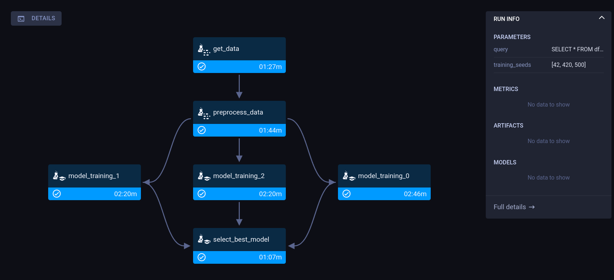
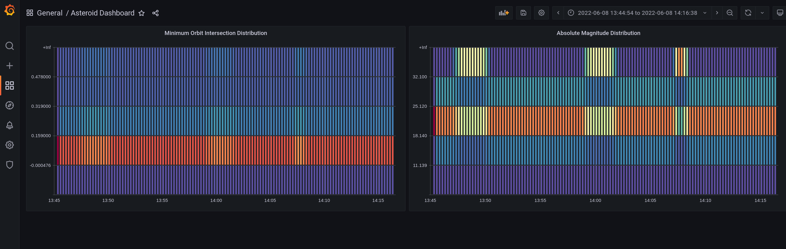
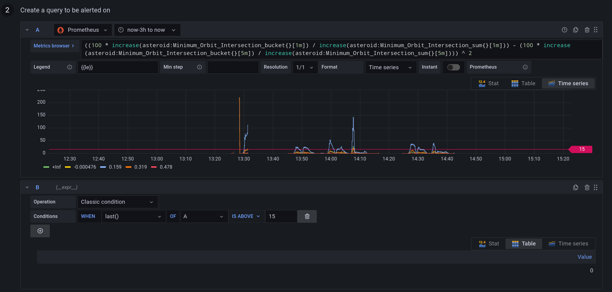

# Asteroid Hazard Detection Example

## Repository overview

This is the big picture overview of the whole setup and the different files that are part of it.

`global_config.py` holds the project name so it can be easily changed project-wide.

### Setup ClearML (will only take like 2 minutes)
https://clear.ml/docs/latest/docs/getting_started/ds/ds_first_steps

You should now have some application credentials you can use to connect to the experiment manager and the model serving engine. Everything is open source, so you can also setup your own server!

### Experimentation Phase
`get_data.py` will take the csv file in `data/nasa.csv`, query on it as if it were a database (for demo purposes) and upload the resulting file to a ClearML versioned dataset.

`preprocessing.py` will take that new dataset, preprocess the data inside into X and y dataframes and add these data as csv files to a new version of the dataset.

`model_training.py` will ingest that preprocessed version of the dataset, get the X and y data and train an XGBoost model on it.

All three of these files will be tracked using the ClearML experiment manager as well as the 2 datasets which are tracked with ClearML-data

### Productionizing Phase
`pipeline.py` is a ClearML pipelinecontroller that will take the above 3 tracked scripts and chain them together in a pipleline.


NOTE: running the pipeline requires at least 1 active ClearML agent running on the same or a remote machine, so it can execute enqueued tasks.

### Deployment Phase
ClearML serving works primarily through a CLI interface, so there is no code that sets it up.

`preprocess_serving.py` however, is used by the CLI to tell ClearML serving what pre- and postprocessing should be done when data is sent to and from the model serving engine.

To learn how to setup serving in detail, check out the [clearml-serving repository](https://github.com/allegroai/clearml-serving). But for this repo, these steps should get you started:


NOTE: Make sure clearml-serving is installed in the virtualenvironment you're using.

1. Create a serving task, note down the ID, we'll need it a lot
```
clearml-serving create --name "asteroid serving"
```

2. Set up the serving stack, in this case using docker-compose (could also be k8s).

Clone the clearml-serving repository
```
git clone https://github.com/allegroai/clearml-serving.git
```

Edit the environment variables in `docker/example.env` to include your ClearML credentials and the serving task ID we copied from step 1

3. If you need any extra python packages installed, set them as comma separated list in the environment variable `CLEARML_EXTRA_PYTHON_PACKAGES` or overwrite the variable in the `docker-compose.yml` file

4. Fire it up!
```
cd docker && docker-compose --env-file example.env -f docker-compose.yml up
```

5. To deploy the model, go back to this repository and run
```
clearml-serving --id __YOUR_SERVING_ID__  model add --engine xgboost --endpoint "asteroid" --preprocess "preprocess_serving.py" --name "model training - best_model" --project "Asteroid Hazard Classification"
```
Or change your model name or project depending on if you're using your own or just following along here.

6. Before you can start to monitor the deployed model we need to tell ClearML which metrics it should log. For that also use the CLI:
```
clearml-serving --id __YOUR_SERVING_ID__  metrics add --endpoint "asteroid" --variable-scalar "Absolute Magnitude=11.139,18.14,25.12,32.1"
```
```
clearml-serving --id __YOUR_SERVING_ID__  metrics add --endpoint "asteroid" --variable-scalar "Minimum Orbit Intersection=-0.000476,0.159,0.319,0.478"
```
7. Go to `http://localhost:3000/` and login to grafana with the default admin:admin combo, then immediately change it.
Now you can go to dashboards and import the dashboard from this repository called `asteroid.json`
Feel free to add alerts and change settings as much as you like :)

8. The grafana alert used in the demo (very simple and NOT very good) can be made like this:
```
((100 * increase(asteroid:Minimum_Orbit_Intersection_bucket{}[1m]) / increase(asteroid:Minimum_Orbit_Intersection_sum{}[1m])) - (100 * increase(asteroid:Minimum_Orbit_Intersection_bucket{}[10m]) / increase(asteroid:Minimum_Orbit_Intersection_sum{}[10m]))) ^ 2
```
You can changethe feature name as well if you want to



### Testing everything
You can use both the `inference.py` script or the `inference.ipynb` to send some mock data. The notebooks should be ran at least once to create the mock data.

